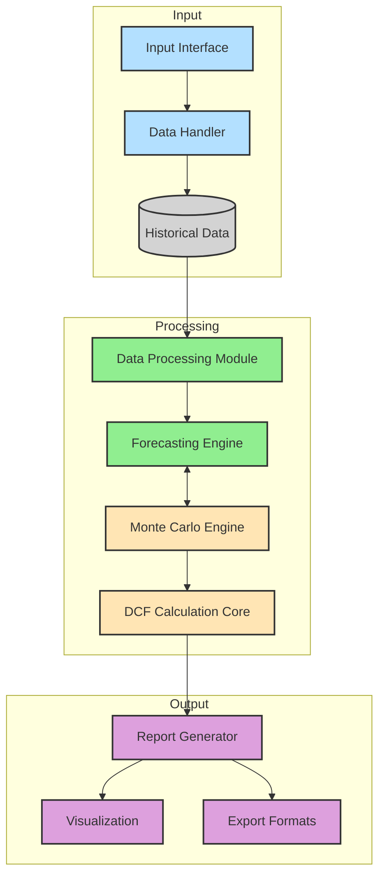

# DCF_Valuation_Model
The model predicts the DCF valuation of any entered stock by taking information of past 3 years of that stock. It then projects the next 10 years of data using Monte Carlo simulation.

[](https://www.youtube.com/watch?v=Qt-FsYG-IGI&autoplay=1)

# Discounted Cash Flow (DCF) Valuation Model

Welcome to the DCF Valuation Model repository. This project is designed to perform comprehensive financial forecasting and valuation using the Discounted Cash Flow methodology.

## Directory Structure



```
arnavagarwal-mr-ar-dcf_valuation_model/
├── app.py                # Main application file to integrate the modules
├── data_processing.py    # Module for cleaning and preparing financial data
├── dcf_calculation.py    # Core logic for DCF calculations
├── forecasting.py        # Financial forecasting logic
├── monte.py              # Monte Carlo simulations for sensitivity analysis
└── report_generator.py   # Generate reports based on DCF analysis
```

## Modules Overview

### 1. **app.py**
This is the entry point of the application. It coordinates the flow between modules and ensures seamless execution of the valuation process.

### 2. **data_processing.py**
Handles data ingestion, cleaning, and preparation. Ensures that the input financial data is in the correct format and ready for analysis.

### 3. **dcf_calculation.py**
Implements the Discounted Cash Flow methodology, including calculations for:
- Free Cash Flow (FCF)
- Discount Rate (Weighted Average Cost of Capital)
- Terminal Value

### 4. **forecasting.py**
Provides tools for financial forecasting based on historical data and assumptions about future performance. 

### 5. **monte.py**
Runs Monte Carlo simulations to evaluate the sensitivity of the valuation to various input assumptions.

### 6. **report_generator.py**
Generates detailed reports summarizing the valuation results, assumptions, and analysis outputs.

## Getting Started

### Prerequisites
- Python 3.9+
- Required libraries are listed in `requirements.txt`. Install them using:


### Running the Application
1. Ensure all dependencies are installed.
2. Run the main application:


## Features
- **Data Preprocessing**: Clean and prepare financial data.
- **DCF Calculation**: Perform accurate valuations using Free Cash Flow projections.
- **Forecasting**: Generate future projections using historical trends and user assumptions.
- **Monte Carlo Simulation**: Analyze risks and sensitivities.
- **Report Generation**: Create professional reports for stakeholders.

## Contributing
Contributions are welcome! Please follow these steps:
1. Fork the repository.
2. Create a new branch (`feature/my-feature`).
3. Commit your changes (`git commit -m 'Add some feature'`).
4. Push to the branch (`git push origin feature/my-feature`).
5. Open a Pull Request.

## License
This project is licensed under the MIT License - see the [LICENSE](LICENSE) file for details.

## Acknowledgements
Special thanks to all contributors and the financial modeling community for their support and guidance.
