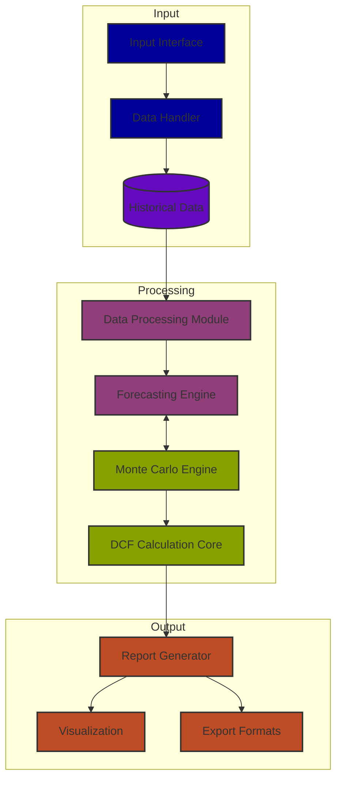

# Discounted Cash Flow (DCF) Valuation Model

Welcome to the DCF Valuation Model repository. This project is designed to perform comprehensive financial forecasting and valuation using the Discounted Cash Flow methodology.

## Youtube Explanation
[](https://www.youtube.com/watch?v=Qt-FsYG-IGI&autoplay=1)

## Try it here 
[Streamlit]([www.google.com](https://dcf-valuation-model.streamlit.app/))


## Workflow


## Directory Structure
```
arnavagarwal-mr-ar-dcf_valuation_model/
├── app.py                # Main application file to integrate the modules
├── data_processing.py    # Module for cleaning and preparing financial data
├── dcf_calculation.py    # Core logic for DCF calculations
├── forecasting.py        # Financial forecasting logic
├── monte.py              # Monte Carlo simulations for sensitivity analysis
└── report_generator.py   # Generate reports based on DCF analysis
```


## Features
- **Data Preprocessing**: Clean and prepare financial data.
- **DCF Calculation**: Perform accurate valuations using Free Cash Flow projections.
- **Forecasting**: Generate future projections using historical trends and user assumptions.
- **Monte Carlo Simulation**: Analyze risks and sensitivities.
- **Report Generation**: Create professional reports for stakeholders.

## Contributing
Contributions are welcome! Please follow these steps:
1. Fork the repository.
2. Create a new branch (`feature/my-feature`).
3. Commit your changes (`git commit -m 'Add some feature'`).
4. Push to the branch (`git push origin feature/my-feature`).
5. Open a Pull Request.

## Contact me 📪
<div id="badges">
  <a href="https://www.linkedin.com/in/arnav-agarwal-571a59243/" target="blank">
   
  </a>
 <a href="https://www.instagram.com/arnav_executes?igsh=MWUxaWlkanZob2lqeA==" target="blank">
 
 </a>
 </a>
 <a href="https://medium.com/@arumynameis" target="blank">
 
 </a>
</div>


## License
This project is licensed under the MIT License - see the [LICENSE](LICENSE) file for details.

## Acknowledgements
Special thanks to all contributors and the financial modeling community for their support and guidance.
